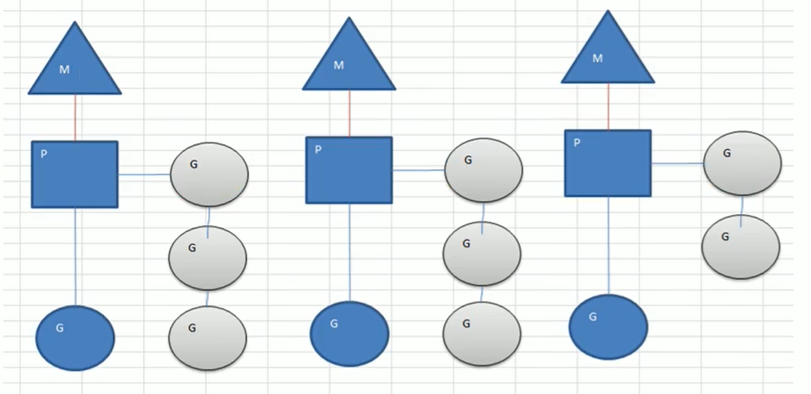
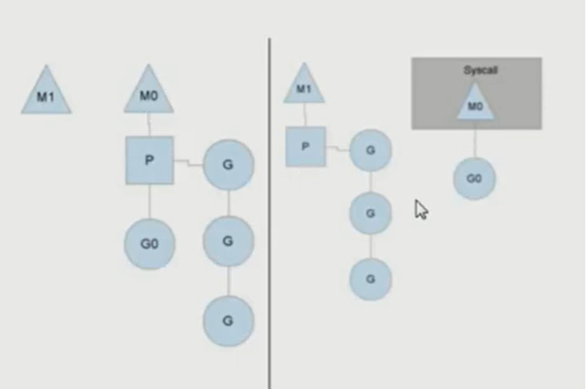

## MPG模式基本介绍

- 1)M:操作系统的主线程（是物理线程）
- 2)P:协程执行需要的上下文
- 3)G:协程

## MPG模式运行的状态1

- 1)当前程序有三个M,如果三个M都在一个cpu运行，就年爱，如果在不同的cpu运行就是年分
- 2)M1,M2,3正在执行一个G,M1的协程队列有三个，M2的协程队列有3个，M3协程队列有2个
- 3)从上图可以看到：G0的顸程是轻量级的线程，是逻辑态的，Go可以容易的起上万个协程。
- 4)其它程序c/java的多线程，往往是内核态的，比较重量级，几千个线程可能耗光cpu

## MPG模式运行的状态2

- 1)分成两个部分来看
- 2)原来的情况是M0主线程正在执行G0协程,另外有三个协程在队列等待 
- 3)如果G0协程阻塞，比如读取文件或者数据库等 
- 4)这时就会创建M1主线程（也可能是从已有的线 程池中取出M1),并且将等待的3个协程挂到 M1下开始执行， M0的主线程下的Go仍然执行文件io的读写。 
- 5)这样的MPG调度模式，可以既让G0执行，同 时也不会让队列的其它协程一直阻塞，仍然可以并发/并行执行。 
- 6)等到G0不阻塞了，M0会被放到空闲的主线程 继续执行（从已有的线程池中取），同时G0又会被唤醒。
